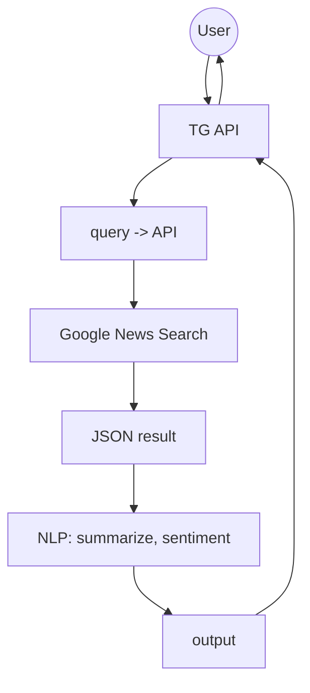

# Telegram News NLP Bot

Small Telegram bot that fetches top news for a topic and applies NLP: summarization and sentiment. Built for fast prototyping.

Made in collaboration with [@AlisaUrikh](https://github.com/AlisaUrikh).

**Content**

1. [Features](#features)  
2. [Flow](#flow)  
3. [Project layout](#project-layout)  
4. [Requirements](#requirements)  
5. [Setup](#setup)  
6. [How it works](#how-it-works)  
7. [Config](#config)  
8. [Testing](#testing)  
9. [Extending](#extending)  
10. [How to use](#how-to-use) 

## Features

* News search via [GNews API](https://gnews.io)
* Up to 5 top headlines with links
* Summarization via `gpt-4o-mini` by OpenAI
* Sentiment analysis of news `gpt-4o-mini` by OpenAI
* Simple Telegram bot interface

## Flow



## Project layout

```
NEWS-TG-BOT/
├── main.py                   # App entrypoint (starts aiogram polling)
├── news_bot/                 # Main application package
│   ├── __init__.py           # Marks this folder as a Python package
│   ├── config.py             # Loads env vars + initializes Bot/Dispatcher
│   ├── constants.py          # Project constants
│   ├── handlers.py           # /start, /help handlers
│   ├── keyboards.py          # Reply/inline keyboards
│   ├── logger_config.py      # Logging configuration
│   ├── news_functions.py     # High-level logic: top news + analysis responses
│   ├── nlp.py                # OpenAI summarization + sentiment
│   ├── search_gnews.py       # GNews API client
│   ├── services.py           # Service instances (gnews_client, nlp_service)
│   └── states.py             # Simple state variables for dialog flow
├── latest_news.json          # Saved/cached news output
├── requirements.txt          # Python dependencies
├── README.md                 # Project documentation
├── .gitignore                # Git ignore rules
├── .env                      # Local secrets (not committed)
└── venv/                     # Local virtual environment (not committed)
```

## Requirements

*Script only runs with VPN turned on due to the OpenAI restrictions.*

* Python 3.10+
* GNews API token
* OpenAI API token
* Telegram Bot token

## Setup

1. Clone and enter:

```bash
git clone <this-repo-url>
cd news-tg-bot
```

2. Create and activate venv:

```bash
python -m venv .venv
source .venv/bin/activate   # Windows: .venv\Scripts\activate
```

3. Install deps:

```bash
pip install -r requirements.txt
```

4. Fill `.env`:

```env
TELEGRAM_TOKEN=your_telegram_bot_token
GNEWS_APIKEY=your_gnews_api_key
OPENAI_APIKEY=your_openai_apikey
```

5. Run:

```bash
cd news_bot
python main.py
```

Open Telegram and send any topic to your bot.

## How it works

* `services/search_gnews.py` calls Google Custom Search to fetch news-like results for the topic.
* `services/nlp.py` calls OpenAI API for 
* `services/telegram_bot.py` wires Telegram handlers.

## Config

`config.py`:

```python
SEARCH_TOP_K = 5
SUMMARY_MAX_TOKENS = 256
```

Tune to your needs. Larger values cost more tokens and time.

## Testing

```bash
pytest -q
```

Simple smoke test calls the flow and checks output shape.

## Extending

* Add NER: new function in `services/nlp.py`.
* Add fact-check: create `services/factcheck.py`.
* Caching: add a small cache layer (e.g., `diskcache` or Redis) around search and model calls.

## How to use

1. Open the bot in Telegram and press **Start** (or send `/start`).
   - The bot will show a menu with 3 buttons:
     - **Топ новостей**
     - **Суммаризация и сентимент анализ**
     - **Помощь**

2. Choose what you want to do:

   **Option A: Top headlines**
   - Tap **Топ новостей** (or send `/top_news`)
   - Send a topic in the next message (at least 2 characters), for example:
     - `инфляция в Европе`
     - `курс рубля`
     - `искусственный интеллект`
   - The bot will return up to **5** headlines with source links (previews are disabled).

   **Option B: Summary + sentiment**
   - Tap **Суммаризация и сентимент анализ** (or send `/extra`)
   - Send a topic in the next message (at least 2 characters)
   - The bot will:
     - fetch up to **5** news items,
     - build a text from up to **3** articles,
     - generate a short summary,
     - return a sentiment label.

3. Help / commands
   - Tap **Помощь** (or send `/help`) to see available commands and tips.

Notes:
- If you send a topic without choosing an option first, the bot will ask you to select an action from the menu.
- If the topic is too short, the bot will ask you to retry.
- If no news is found for the query, the bot will return `Новости не найдены.` or `Недостаточно данных`.


