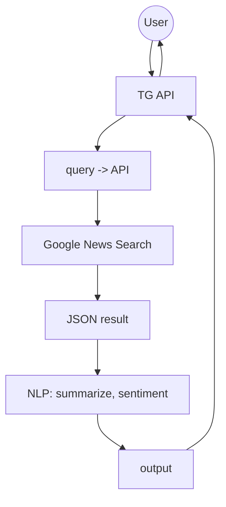

# Telegram News NLP Bot

Small Telegram bot that fetches top news for a topic and applies NLP: summarization and sentiment. Built for fast prototyping.

## Features

* Google News search via Custom Search JSON API
* Top 5 headlines with links
* Summarization (HF transformers)
* Sentiment analysis of summaries
* Simple Telegram interface

## Flow



## Project layout

```
project/
├── .env
├── .gitignore
├── requirements.txt
├── config.py
├── text_loader.py
├── services/
│   ├── search.py
│   ├── nlp.py
│   └── telegram_bot.py
├── main.py
└── tests/
    ├── result.json
    └── test_flow.py
```

## Requirements

* Python 3.10+
* Telegram Bot token
* Google Custom Search API key and CSE ID

## Setup

1. Clone and enter:

```bash
git clone <this-repo-url>
cd project
```

2. Create and activate venv:

```bash
python -m venv .venv
source .venv/bin/activate   # Windows: .venv\Scripts\activate
```

3. Install deps:

```bash
pip install -r requirements.txt
```

4. Fill `.env`:

```env
TELEGRAM_TOKEN=your_telegram_bot_token
GOOGLE_API_KEY=your_google_api_key
GOOGLE_CSE_ID=your_custom_search_engine_id
```

5. Run:

```bash
python main.py
```

Open Telegram and send any topic to your bot.

## How it works

* `services/search.py` calls Google Custom Search to fetch news-like results for the topic.
* `services/nlp.py` loads HF pipelines:

  * Summarization: `facebook/bart-large-cnn`
  * Sentiment: default `sentiment-analysis`
* `text_loader.py` orchestrates search -> summarize -> sentiment -> format output.
* `services/telegram_bot.py` wires Telegram handlers.

## Config

`config.py`:

```python
SEARCH_TOP_K = 5
SUMMARY_MAX_TOKENS = 256
```

Tune to your needs. Larger values cost more tokens and time.

## Testing

```bash
pytest -q
```

Simple smoke test calls the flow and checks output shape.

## Notes and tips

* Google Custom Search needs a CSE that targets news sources. Adjust CSE config for better results.
* Summarization input uses the result snippet. Replace with fetched article text if you add an HTML fetcher and cleaner.
* First run will download HF models. Expect a delay and disk use.
* If you run on Apple Silicon and hit torch issues, install PyTorch from the official instructions for your platform.

## Extending

* Add NER: new function in `services/nlp.py`, then render in `text_loader.py`.
* Add fact-check: create `services/factcheck.py` for Google Fact Check API and wire in the flow.
* Caching: add a small cache layer (e.g., `diskcache` or Redis) around search and model calls.